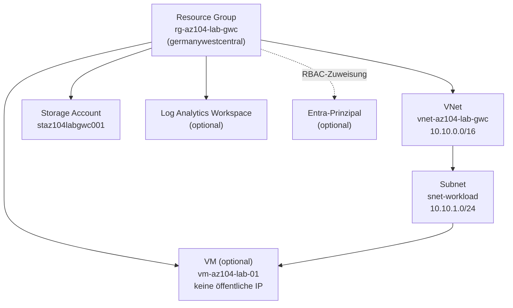

Diese Sammlung ist ein sicherer Ausgangspunkt fuer eine persoenliche AZ-104-Lernumgebung. Die Skripte sind absichtlich modular und wiederholbar: bereits vorhandene Ressourcen werden normalerweise nicht veraendert.

## Architektur

Alle Ressourcen liegen in derselben Resource Group und tragen ein einheitliches Tag-Set (`Project`, `Environment`, `Owner`, `Purpose`, `ManagedBy`). Die VM erhält bewusst keine öffentliche IP-Adresse; Zugriff erfolgt ausschließlich innerhalb des VNets bzw. optional per RBAC-Rollenzuweisung auf Ressourcengruppen-Ebene.

## Einmal vorbereiten

1. Installiere das Az-Modul: `Install-Module Az -Scope CurrentUser`
2. Kopiere `config.ps1` zu `config.local.ps1` und trage dort deine echte Subscription-ID ein (z.B. per `(Get-AzContext).Subscription.Id`). `config.local.ps1` ist in `.gitignore` eingetragen und wird nie eingecheckt – `config.ps1` bleibt eine Vorlage ohne persoenliche Werte.
3. Melde dich an und waehle die Subscription: `.\00-connect-and-context.ps1 -ConfigPath .\config.local.ps1`

Alle Skripte akzeptieren `-ConfigPath`; ohne Angabe wird die eingecheckte `config.ps1`-Vorlage geladen (mit Platzhalter-Subscription-ID, das wird fehlschlagen). Fuer den taeglichen Gebrauch also immer `-ConfigPath .\config.local.ps1` mitgeben, oder ganz oben im eigenen `config.local.ps1` alles so eintragen, wie du es brauchst.

## Empfohlene Reihenfolge

1. `.\01-resource-group.ps1 -ConfigPath .\config.local.ps1`
2. `.\02-networking.ps1 -ConfigPath .\config.local.ps1`
3. `.\03-storage.ps1 -ConfigPath .\config.local.ps1`
4. Optional RBAC: `.\04-identity-rbac.ps1 -ConfigPath .\config.local.ps1 -PrincipalObjectId '<Entra-Objekt-ID>' -Role Reader`
5. Optional VM: `.\05-virtual-machine.ps1 -ConfigPath .\config.local.ps1 -LocalAdminCredential (Get-Credential)`
6. Optional Monitoring: `.\06-monitoring.ps1 -ConfigPath .\config.local.ps1`

Vorschau ohne Aenderungen: jedes Erstellungsskript mit `-WhatIf` aufrufen. Die VM erhaelt absichtlich **keine oeffentliche IP-Adresse**. Das vermeidet eine versehentlich direkt aus dem Internet erreichbare Lern-VM.

## Kosten und Aufraeumen

Azure berechnet manche Ressourcen auch dann weiter, wenn du sie nicht verwendest. Nach der Uebung loescht `.\99-cleanup-lab.ps1` die gesamte Ressourcengruppe inklusive aller enthaltenen Ressourcen. Fuehre es bewusst aus; es fragt wegen der hohen Auswirkung nochmals nach.

## Troubleshooting (real aufgetretene Probleme)

**"Resource ... was disallowed by Azure: The selected region is currently not accepting new customers" (403)**
Manche Subscription-Typen (u.a. Free-Trial/Sponsorship) sind fuer bestimmte Regionen gesperrt. `westeurope` war betroffen, `germanywestcentral` funktionierte. Bei diesem Fehler in `config.local.ps1` einfach eine andere Region eintragen und die Ressourcengruppe neu aufbauen (`.\99-cleanup-lab.ps1` → `.\01-resource-group.ps1` → ...).

**Az-Module scheinen nach einem Neustart "verschwunden"**
Windows PowerShell 5.1 (`Documents\WindowsPowerShell\Modules`) und PowerShell 7 (`Documents\PowerShell\Modules`) nutzen getrennte Modul-Pfade (`$env:PSModulePath`). Wenn eine Installation in der einen Shell erfolgte und das Skript spaeter in der anderen Shell laeuft, wirken die Module "fehlend", obwohl sie nur im falschen Pfad-Kontext nicht sichtbar sind. Schneller Check: `Get-Module -ListAvailable -Name Az.* | Measure-Object` sollte rund 90 Module zeigen; eine deutlich kleinere Zahl weist auf eine unvollstaendige Installation im aktuellen Shell-Kontext hin.

## Lernbezug

Die Dateien decken die Kernbereiche von AZ-104 ab: Identitaet/RBAC, Governance durch Tags und Ressourcengruppen, Storage, virtuelle Netzwerke, VMs sowie Monitoring. Fuer Themen wie Azure Policy, Backup, Load Balancer und Entra-Gruppen dienen sie als Ausgangspunkt und koennen nach derselben Struktur erweitert werden.
